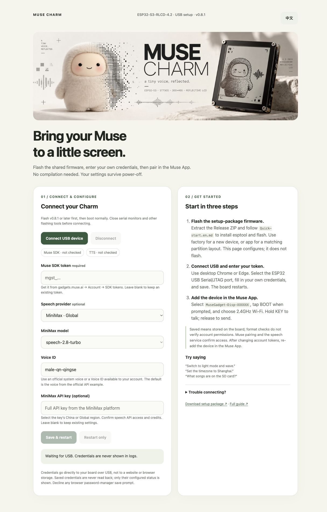

<div align="center">


# Muse Charm

**A little Muse companion that listens, speaks, dances and controls its own hardware.**

[](https://github.com/espressif/esp-idf/releases/tag/v6.0.1)
[](https://www.waveshare.com/esp32-s3-rlcd-4.2.htm)
[](LICENSE)

[**中文：完整安装、玩法与接入说明**](README.zh-CN.md) · [Official Muse Gadget SDK](https://github.com/facebookincubator/muse-gadget-sdk) · [Board documentation](https://docs.waveshare.com/ESP32-S3-RLCD-4.2)


*Preview rendered by the firmware's own drawing code. The physical screen is monochrome and reflective, with no backlight.*

</div>

## What works

| Feature | Implementation / validation |
| :--- | :--- |
| Push-to-talk | Hold KEY, speak, release. Official Muse account/VM conversation; microphone and speaker tested on hardware |
| Spoken replies | Qwen TTS → MP3 → ES8311 speaker; audible playback confirmed. The upstream text/silence pacing is not a hosted TTS service |
| Animated companion | Official pixel avatar, listening and speech, plus thinking stars, hearts, dance, wave, sleep, hop, peek and stretch reactions at about 5 FPS |
| Paper / ink UI | White outlined avatar or dark background; clean header with compact time, connection and battery percentage; no quota or divider |
| Reply bubble | Chinese text captions, paging during spoken replies; solid Noto Sans CJK Medium glyphs in a rounded bubble, fallback boxes for missing glyphs |
| Rotation | Entire screen turns left/right in 90° steps; all four orientations, responsive layouts and persistence |
| Hardware awareness | Muse discovers commands for theme, reactions, rotation, battery, SD, sensors, music and speech |
| Battery | Calibrated GPIO4 ADC, voltage smoothing and **estimated** percentage; populated in `device.health` |
| Sensors / clock | SHTC3 temperature/humidity and PCF85063 RTC; live readings verified |
| SD card | FAT32 listing, small text reads and MP3 playback; no formatting or writes; local music confirmed audible |
| Network music | Public HTTP(S) MP3 streaming, resampling and stop; network playback confirmed audible |
| BLE HID | Lightweight NimBLE HOGP client, descriptor parser, notifications and remembered-peer reconnect; **Q36 connection/button compatibility still unverified** |
| Desktop Muse | Same account and VM through the official encrypted link; USB text chat and local diagnostics included |

The battery percentage is a 3.0–4.12V voltage estimate, not a fuel-gauge measurement. Charging state is unknown and charging can raise the estimate. Temperature is affected by board heat. Location is a user label, not GPS. The screen supports black and white only.

## Play with Muse

Ask Muse to change the timezone to Shanghai, Los Angeles, New York or a fixed UTC offset. Supported regions use daylight-saving rules; fixed offsets do not. Settings persist.

Try asking Muse to switch to light mode, turn left 90°, dance, wave, report its battery, read room temperature/humidity, list SD songs or search for a playable network song.

| Command | Example |
| :--- | :--- |
| `charm.status` | Device, battery, connection, time, location label and orientation |
| `charm.configure` | `{"mode":"light","rotate":"left","reaction":"dance","location":"desk","timezone":"Asia/Shanghai"}` |
| `charm.sensors` | Temperature, relative humidity and RTC validity |
| `charm.storage.list` | `{"path":"music"}`; omit path for root; up to 64 entries |
| `charm.storage.read` | `{"path":"notes.txt"}`; up to 2,048 bytes |
| `charm.music` | `{"url":"https://example.org/song.mp3"}`, `{"path":"music/song.mp3"}` or `{"action":"stop"}` |
| `charm.speak` | `{"text":"Hello from Muse Charm!"}` |
| `charm.controller` | `{"action":"pair"}` or `{"action":"disconnect"}` |

Commands are registered with the official `commands_v2` interface. For network requests, Muse needs web search on its VM and an accessible **direct MP3 URL**. Website links, DRM services, YouTube pages, HLS, AAC and FLAC are not supported inputs. No commercial music catalog or subscription login is bundled. A queued response means accepted, not downloaded successfully. Only one audio job runs at a time. Spoken music requests wait for the voice reply to finish; ending a text chat preserves music or speech started by a hardware command.

| Button | Action |
| :--- | :--- |
| KEY | Hold to record, release to send; press during music to stop it |
| BOOT | Confirm initial pairing; once paired, single press toggles theme, double press rotates right; hold 5 seconds resets pairing/Wi-Fi |
| PWR | Original hardware power control; not a programmable GPIO button |


KEY/BOOT cues follow the physical button edge in every orientation, with a pressed rail and state feedback. PWR is hardware controlled and has no readable button GPIO.

## Bring your own services

- **Required:** Muse account/App, SDK token and usable VM; 2.4GHz Wi-Fi.
- **For spoken replies:** Aliyun Token Plan API key with `qwen-audio-3.0-tts-plus` access. This supplies speech, not the Muse conversation model.
- **For network song discovery:** web search available to Muse; the board plays the resulting audio URL.
- **Optional:** FAT32 SD card and a compatible BLE HID gamepad. ESP32-S3 does not support Bluetooth Classic HID.

Current TTS integration uses the [native Qwen HTTP API](https://help.aliyun.com/zh/model-studio/qwen-audio-tts-http-api), not `compatible-mode/v1`:

```text
https://token-plan.cn-beijing.maas.aliyuncs.com/api/v1/services/audio/tts/SpeechSynthesizer
model: qwen-audio-3.0-tts-plus
voice: longanhuan_v3.6
output: MP3 / 16000 Hz
```

Without a TTS key, local/network MP3 playback still works. Supply your own SDK token and optional TTS key through USB setup. Only source builds require a local signing key; private credentials and signing keys are not distributed.

## 🚀 No-build setup package

**Online setup: [eazylee.xyz/muse-charm](https://eazylee.xyz/muse-charm/)**. Use desktop Chrome/Edge; credentials go directly to your board over USB. The page supports English / 中文, including instructions, provider fields and connection/save messages.



Download `muse-charm-v0.8.1-setup.zip` from the [latest Release](https://github.com/EazyLee30/muse-charm/releases/latest). Follow `开始使用.md` to flash the credential-free firmware, then open `setup/index.html` in desktop **Chrome/Edge**.

1. Connect the ESP32 USB Serial/JTAG port.
2. Enter your own Muse SDK token from gadgets.muse.ai → Account → SDK tokens; optionally select Ali Token Plan or MiniMax China/global and enter the corresponding key.
3. Save and restart, then pair in the Muse App and select 2.4GHz Wi-Fi.

Credentials persist in device NVS. Runtime SDK tokens override the optional compile-time token. The page reports configured/not configured without reading back credentials, making network requests, or writing browser storage. Leave configured fields blank to preserve them. Format validation does not verify service authorization.

If local-file serial access is unavailable, run `python3 -m http.server 8765 --bind 127.0.0.1` in the extracted folder and open `http://localhost:8765/setup/`. Safari/Firefox are unsupported. Close other serial tools and boot normally before configuring. Flashing uses Python + esptool; ESP-IDF and compilation are unnecessary.

No personal credentials ship in the package. NVS is currently unencrypted: do not publish Flash/NVS dumps. After changing account tokens, restart and re-add the device in Muse. Pairing reset preserves device-level SDK/TTS keys.

## Build and install

```bash
git clone https://github.com/EazyLee30/muse-charm.git
cd muse-charm
. "$IDF_PATH/export.sh"  # ESP-IDF v6.0.1
espsecure generate-signing-key --version 2 dev_signing_key.pem
tools/board.sh waveshare-s3-rlcd42 menuconfig
# Set local signing-key path; SDK token may stay empty for USB setup
tools/board.sh waveshare-s3-rlcd42 build
```

For a fresh board, install bootloader, partition table and app with `tools/board.sh waveshare-s3-rlcd42 flash PORT`. If automatic USB reset fails, hold BOOT, tap RESET, then release BOOT. Use **DIO 80MHz**.

For a board already running this project's matching partition layout, update only the application to preserve Wi-Fi and pairing:

```bash
python -m esptool --chip esp32s3 --port /dev/cu.usbmodem1101 \
  --before usb-reset --after hard-reset --baud 115200 --no-stub \
  write-flash --flash-mode dio --flash-freq 80m --flash-size 16MB \
  0x20000 build-waveshare-s3-rlcd42/muse-gadget.bin
```

Add `MuseGadget-Disp-XXXXXX` from the Muse App's device/developer-device screen, short-press BOOT when prompted, then choose Wi-Fi. The device restarts after provisioning. Desktop Muse should use the same account/VM. If the server explicitly revokes device credentials, re-add it in the App.

### Configure speech and use USB tools

Install Python `pyserial`. Create an ignored private `.cache/tts.json` with `{"key":"YOUR_API_KEY"}`:

```bash
chmod 600 .cache/tts.json
python3 tools/charm.py tts-setup .cache/tts.json
python3 tools/charm.py speak 'Hello from Muse Charm!'
python3 tools/charm.py status
python3 tools/charm.py configure --mode light --rotate left --reaction wave
python3 tools/charm.py sensors
python3 tools/charm.py list music
python3 tools/charm.py music 'music/song.mp3'
python3 tools/charm.py music --stop
python3 tools/muse/chat.py --port /dev/cu.usbmodem1101 'Inspect this gadget and wave'
```

Only one program may own the serial port. TTS setup persists the key in NVS without echoing it or exposing it to Muse commands; this development profile uses plaintext NVS. Endpoint/model/voice are configured in `components/muse/muse_tts.c`. Other providers need an adapter.

For an audio hardware check, send `>audio.test` on the 115200-baud console. It plays fixed-volume 440/660Hz tones. KEY recordings log sample count, peak and RMS. Never publish private `sdkconfig`, signing keys, API keys or firmware binaries containing your SDK token.

## Q36 status — testing deferred

The [manufacturer's Q36XDV manual](https://fccid.io/2A3VP-Q36/User-Manual/User-manual-7156117.pdf) describes X mode as `XBOX Wireless Controller`, fast blue flashing for pairing, steady blue when connected; D mode is `Q36 for Android`. Variant and mode must actually expose BLE HID to work here. A flashing LED or product name alone does not establish compatibility.

Gamepad testing is deferred; boot does not automatically scan. After Muse pairing, ask to pair a gamepad or run `python3 tools/charm.py pair`. The scan window is three minutes. The implementation remembers a successfully subscribed peer for reconnect when scanning is explicitly requested. Intended mapping: **A hearts, B theme, X dance, Y wave, D-pad movement**. This board scans BLE successfully, but Q36 pairing and button reports have not yet been verified. No emulator or second Bluetooth stack was imported.

## Hardware and source

| Module | Pins / address |
| :--- | :--- |
| LCD | ST7305, native 300×400; landscape 400×300; MOSI12, SCLK11, DC5, CS40, RST41 |
| Audio | ES8311 `0x18`, ES7210 `0x40`/`0x42`; I²C SDA13/SCL14 |
| I²S / amplifier | MCLK16, BCLK9, LRCK45, DOUT8, DIN10, PA46 active high |
| Battery | GPIO4 / ADC1_CH3, divider ×3 |
| SDMMC | 1-bit CLK38, CMD21, D039 |
| Sensors | SHTC3 `0x70`, PCF85063 `0x51`, shared I²C |
| Buttons | BOOT0, KEY18, hardware PWR |

`main/charm*` implements hardware commands, sensors, BLE HID and fonts. `main/rlcd42_status.c` and `avatar/muse_pixel.c` draw the UI. `main/voice*` and `components/muse/muse_tts.c` handle audio. `tools/preview_charm.py` renders the README preview; `tools/gen_charm_font.py` generates the 18px Noto Sans CJK SC Medium subset (see [font licensing](docs/OFL-NotoSansCJK.txt)). The generated glyphs are committed; regeneration needs Pillow and the official OTF in `.cache/fonts/NotoSansCJKsc-Medium.otf`.

Hardware validation uses ESP-IDF 6.0.1, ESP32-S3 v0.2, 16MB flash / 8MB PSRAM. App size is about 1.75MiB, with about 12% free in its 2MiB partition. Based on the Meta Muse Gadget SDK under [Apache 2.0](LICENSE), with upstream avatar/font licenses and [Waveshare reference examples](https://github.com/waveshareteam/ESP32-S3-RLCD-4.2).

Validation includes focused Charm/UI, audio ownership and pairing recovery host tests, plus hardware voice, music, four orientations and button feedback. The full upstream suite did not finish in its camera/tunnel harnesses on this Mac. A second full-UI board compiled in an isolated test copy after filling two existing upstream `WAITING_FOR_WIFI` switch cases; that workaround is not included in this board change.

USB setup validation: runtime SDK save, invalid-format rejection, reboot persistence and restored Muse connectivity confirmed on the board. The actual page JavaScript passes split-response USB, partial-save and restart tests; Chrome rendering was checked.

MiniMax support uses the [official native synchronous API](https://platform.minimax.io/docs/api-reference/speech-t2a-http), China `api.minimax.cn` or global `api.minimax.io`, default `speech-2.8-turbo` / `male-qn-qingse`, configurable model and Voice ID, 16kHz mono MP3 URL output. Contract/error/URL tests pass; paid synthesis has not been verified without an authorized MiniMax key. Qwen speech is hardware-verified.
