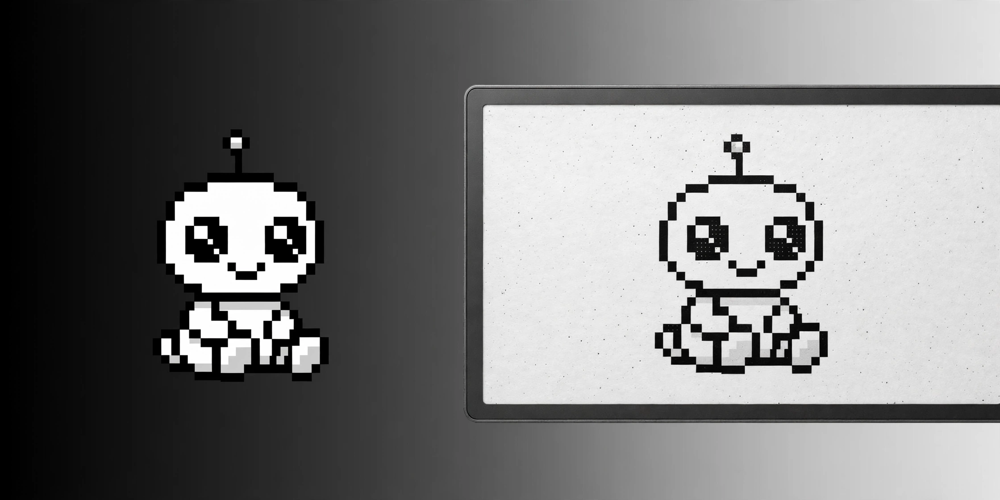
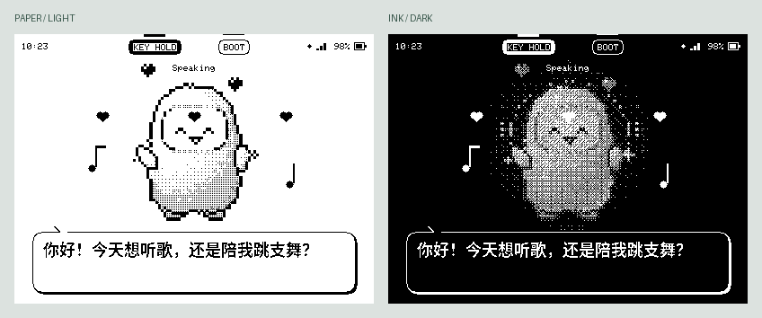
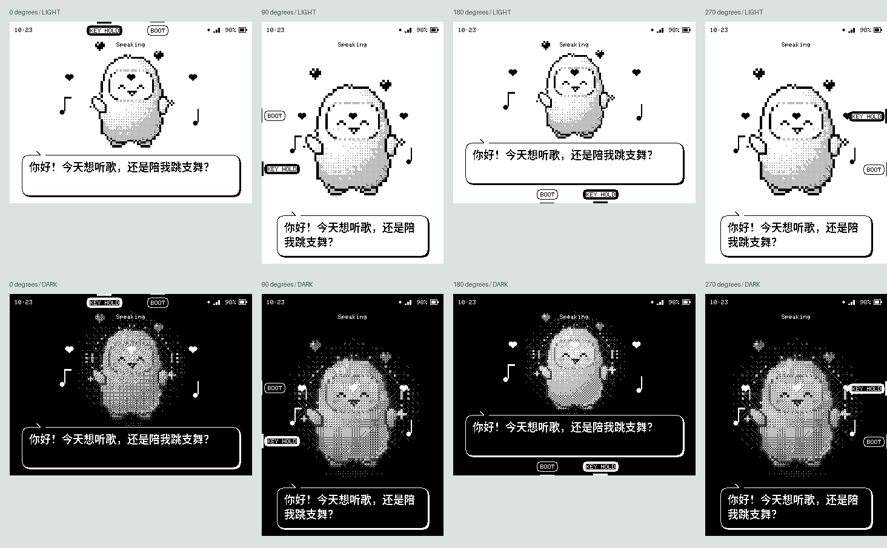

<div align="center">



# Muse Charm · 把 Muse 带到桌面上

**会听、会说、会跳舞，也能让 Muse 操作自己的屏幕和扬声器。**

[](https://github.com/espressif/esp-idf/releases/tag/v6.0.1)
[](https://www.waveshare.com/esp32-s3-rlcd-4.2.htm)
[](LICENSE)

[English](README.md) · [官方 Muse Gadget SDK](https://github.com/facebookincubator/muse-gadget-sdk) · [板子文档](https://docs.waveshare.com/ESP32-S3-RLCD-4.2)



*由当前固件绘图代码生成的预览。实物是无背光的黑白反射式屏幕。*

</div>

## 现在可以怎么玩

| 功能 | 当前实现与验证范围 |
| :--- | :--- |
| 🎙️ 和 Muse 说话 | 按住 KEY 说话，松开发送到已配对账号的 Muse；麦克风和喇叭已实板验证 |
| 🔊 真实语音回复 | 千问 TTS → MP3 解码 → ES8311 扬声器；已确认出声。官方 SDK 的文字静音节奏不是托管 TTS 服务 |
| 🐾 动态 Muse | 官方像素形象、眨眼、聆听、说话；增加思考星星、爱心、跳舞、挥手、睡觉、蹦跳、躲猫猫和伸懒腰反应，约 5 FPS |
| 💬 中文气泡 | 语音回复显示小气泡，长回复分段更新；Noto Sans CJK Medium 实心字形、圆角气泡，未覆盖的字显示占位框 |
| 🌗 主题与转向 | 浅色纸面、深色背景；整屏向左/右旋转 90°，支持四个方向和横竖屏重新布局，重启保存 |
| 🔋 顶栏 | 小号紧凑时间、Wi-Fi、Muse 连接、手柄状态、具体电量百分比；无 MUSE 标题、无横线、无账号额度 |
| 🌡️ 板载传感器 | SHTC3 温湿度、PCF85063 RTC；实板已读到数据 |
| 💾 SD 卡 | FAT32 目录、文件大小、小文本读取、本地 MP3；插入的卡已读取并正常放歌，不自动格式化、不写卡 |
| 🎵 网络音乐 | HTTP(S) MP3 流式播放、采样率转换和停止。Muse 可搜索直链后调用；不内置商业曲库登录或 DRM 解密 |
| 🎮 BLE 手柄 | HOGP 扫描、配对、HID 描述符解析、按键映射和记忆重连已实现；**Q36 实机连接尚未确认成功** |
| 💻 电脑里的 Muse | 使用同一账号及 VM，硬件通过官方加密连接提供能力；另有 USB 文字聊天与诊断工具 |

**电量是电压估算值**：GPIO4/ADC1_CH3，经板上三倍分压换算、校准与平滑。当前用 3.0–4.12V 映射到 0–100%，不是电量计的精确剩余容量；充电中读数可能偏高，充电状态仍为未知。`device.health` 已填入电量和电压。

屏幕只有黑白，不能显示彩色背景。时区可说“改成上海 / 洛杉矶 / 纽约 / UTC+08:00”，保存后重启仍生效；常用地区按规则处理夏令时，固定 UTC 偏移不自动调整。

位置是用户设置的标签（例如“书桌”），没有 GPS、自动定位或运动传感器。板载温度会受芯片发热影响。

## 直接对 Muse 说

> “切换浅色模式。” · “向左转 90 度。” · “挥挥手，跳个舞，蹦一下，伸个懒腰。” · “时区改成上海。”
>
> “你现在有多少电？” · “读一下温度和湿度。” · “你现在在我的书桌上。”
>
> “看看 SD 卡里有哪些歌，播放 music 文件夹里的歌。”
>
> “搜索一首可以直接播放的网络歌曲，然后在 Muse Charm 上放。”

硬件通过官方 `commands_v2` 注册能力，Muse 能发现并调用。网络点歌需要 Muse VM 的联网搜索能力和可访问的 **MP3 音频直链**：网页、YouTube 页面、需要登录的曲库、HLS/AAC/FLAC 都不是当前播放器支持的输入。找不到合适音源时应说明原因，也可以改放 SD 卡里的歌。

| Muse 工具 | 参数示例 |
| :--- | :--- |
| `charm.status` | 电量、连接、时间、主题、方向、位置标签 |
| `charm.configure` | `{"mode":"light","rotate":"left","reaction":"dance","location":"书桌","timezone":"Asia/Shanghai"}` |
| `charm.sensors` | 温度、相对湿度、RTC 有效性 |
| `charm.storage.list` | `{"path":"music"}`；省略路径列根目录，最多 64 项 |
| `charm.storage.read` | `{"path":"notes.txt"}`；最多 2048 字节文本 |
| `charm.music` | `{"url":"https://example.org/song.mp3"}` / `{"path":"music/song.mp3"}` / `{"action":"stop"}` |
| `charm.speak` | `{"text":"你好，我是 Muse Charm。"}` |
| `charm.controller` | `{"action":"pair"}` / `{"action":"disconnect"}` |

一次只播放一段音频；忙碌时命令返回错误，`queued` 仅表示受理，不保证远程音源下载成功。KEY 可停止音乐。语音点歌会等 Muse 的口头回复播完再开始；文字会话结束不会打断硬件命令发起的音乐或播报。



KEY 和 BOOT 提示固定在对应的物理屏幕边缘，按下时边缘横条加粗、提示变为按压状态；旋转时位置和文字一起调整。PWR 为硬件电源键，无法读取其按压状态来做反馈。

## 三个板载按键

| 按键 | 操作 |
| :--- | :--- |
| **KEY** | 按住录音，松开发送；音乐播放时按一下停止音乐 |
| **BOOT** | 配对时短按确认；配对完成后单击换主题、双击向右转 90°；长按 5 秒恢复配对/Wi-Fi 设置 |
| **PWR** | 板子的硬件电源控制，沿用原厂开关机功能；没有可供固件重映射的按键 GPIO |

## 需要自行接入什么

| 项目 | 是否必需 | 用途 |
| :--- | :--- | :--- |
| Muse 账号、App、SDK token 与可用 VM | 必需 | 手机配对、账号身份、语音识别、Muse 回复与工具调用 |
| 2.4GHz Wi-Fi | 必需 | 连接 Muse、TTS 和网络音源 |
| 阿里云 Token Plan API key，且支持 `qwen-audio-3.0-tts-plus` | 语音播报需要 | 当前独立 TTS 提供方；不替换 Muse 的对话模型 |
| Muse VM 联网搜索 | 网络点歌需要 | 搜索可播放的 MP3 直链；固件自身没有搜索引擎 API key |
| FAT32 SD 卡 | 可选 | 本地 MP3、目录与文本读取；现有文件可继续使用 |
| BLE HID 游戏手柄 | 可选、兼容性待实测 | 互动按键；ESP32-S3 不支持经典蓝牙 HID |

TTS 使用[千问原生语音合成接口](https://help.aliyun.com/zh/model-studio/qwen-audio-tts-http-api)：

```text
https://token-plan.cn-beijing.maas.aliyuncs.com/api/v1/services/audio/tts/SpeechSynthesizer
model: qwen-audio-3.0-tts-plus
voice: longanhuan_v3.6
format: MP3 / 16000 Hz
```

`compatible-mode/v1` 是兼容接口地址，当前 TTS 代码使用上面的原生接口。无 TTS key 时仍可播放 SD/网络 MP3；Muse 的语音播报需要配置 key。SDK token、API key、配对数据和签名私钥均由使用者自行配置，不随仓库提供。

## 构建、刷机与配对

```bash
git clone https://github.com/EazyLee30/muse-charm.git
cd muse-charm
. "$IDF_PATH/export.sh"  # ESP-IDF v6.0.1
espsecure generate-signing-key --version 2 dev_signing_key.pem
tools/board.sh waveshare-s3-rlcd42 menuconfig
# 设置 Gadget SDK Token，以及本地签名私钥路径
tools/board.sh waveshare-s3-rlcd42 build
```

新板首次安装需要 bootloader、分区表和应用，可用 `tools/board.sh waveshare-s3-rlcd42 flash PORT`。如果原生 USB 自动进入下载模式失败，按住 BOOT、短按 RESET，再松开 BOOT。

对已经安装本项目、分区布局一致的板子，**只更新应用**可保留 NVS 里的 Wi-Fi 与配对数据：

```bash
python -m esptool --chip esp32s3 --port /dev/cu.usbmodem1101 \
  --before usb-reset --after hard-reset --baud 115200 --no-stub \
  write-flash --flash-mode dio --flash-freq 80m --flash-size 16MB \
  0x20000 build-waveshare-s3-rlcd42/muse-gadget.bin
```

使用 DIO 80MHz。不要把含私人 SDK token 的固件、sdkconfig、API key 或签名私钥上传到公共仓库。

1. 打开 Muse App 的设备/开发者设备入口，添加 `MuseGadget-Disp-XXXXXX`。
2. 按提示短按 BOOT 确认，选择 2.4GHz Wi-Fi。
3. 配对后板子重启并连接 Muse；连接成功后按住 KEY 说话。
4. 电脑端使用同一账号和 VM。若服务端明确撤销了设备凭证，需要在 App 中重新添加设备。

### 配置 TTS

安装 Python `pyserial`，创建本地私密文件 `.cache/tts.json`，格式为 `{"key":"你的 API key"}`。该目录已被 Git 忽略；请限制文件权限。

```bash
chmod 600 .cache/tts.json
python3 tools/charm.py --port /dev/cu.usbmodem1101 tts-setup .cache/tts.json
python3 tools/charm.py speak '你好，我是你的 Muse Charm。'
```

key 写入板子的 NVS，不经 Muse 工具暴露，也不在串口回显。当前开发板 NVS 未启用硬件加密。当前接口、模型与音色在 `components/muse/muse_tts.c` 中配置，更换服务商需要适配提供方。

### USB 调试与电脑文字聊天

串口一次只能由一个工具占用。

```bash
python3 tools/charm.py status
python3 tools/charm.py configure --mode light --rotate left --reaction wave --timezone Asia/Shanghai
python3 tools/charm.py sensors
python3 tools/charm.py list music
python3 tools/charm.py music 'music/song.mp3'
python3 tools/charm.py music --stop
python3 tools/muse/chat.py --port /dev/cu.usbmodem1101 '你好，看看这台硬件能做什么'
```

在 115200 波特率的串口控制台发送 `>audio.test` 可播放固定音量双音，用来检查喇叭、DAC 和功放。录音日志显示采样数量、峰值与 RMS，便于检查麦克风。

## Q36 手柄：暂缓调试

按当前需求暂缓手柄调试，开机不会自动扫描；只有明确请求配对才扫描。轻量 NimBLE HOGP 客户端已加入；没有搬入 Game Boy 模拟器或第二套蓝牙栈。已验证板子可以扫描周边 BLE 广播、主机 HID 解析测试通过，**本次 Q36 尚未完成实际连接与按键验证**。

[厂家提交的 Q36XDV 使用说明](https://fccid.io/2A3VP-Q36/User-Manual/User-manual-7156117.pdf)中，X 档名为 `XBOX Wireless Controller`，配对蓝灯快闪，成功蓝灯常亮；D 档为 `Q36 for Android`。不同版本/模式是否提供 BLE HID 必须实际确认，不能凭蓝灯或产品名认定兼容。

完成 Muse 配对后，说“开始连接游戏手柄”或运行 `python3 tools/charm.py pair`，再让手柄进入配对。扫描窗口三分钟。连接并订阅成功后记忆身份，再次手动开启扫描后按已记忆身份重连。预设映射：**A 爱心、B 换主题、X 跳舞、Y 挥手、方向键左右移动**。只有真正订阅到输入报告，顶栏才显示已连接。

## 硬件与源码

| 模块 | 引脚 / 地址 |
| :--- | :--- |
| ST7305 反射式 LCD | 原生 300×400；默认横屏 400×300；MOSI12、SCLK11、DC5、CS40、RST41 |
| ES8311 DAC / ES7210 双麦 | I²C `0x18` / `0x40`（备选 `0x42`）；SDA13、SCL14 |
| I²S / 功放 | MCLK16、BCLK9、LRCK45、DOUT8、DIN10、PA46（高电平启用） |
| 电池采样 | GPIO4 / ADC1_CH3，电压乘三 |
| SDMMC | 1-bit：CLK38、CMD21、D039 |
| 温湿度 / RTC | SHTC3 `0x70` / PCF85063 `0x51`，共享 I²C |
| 按键 | BOOT0、KEY18；PWR 是硬件电源控制 |

- `main/charm*`：硬件能力、传感器、BLE HID、压缩字体。
- `main/rlcd42_status.c`、`avatar/muse_pixel.c`：界面、旋转和动画。
- `main/voice*`、`components/muse/muse_tts.c`：采集、播报与音乐。
- `tools/charm.py`：USB 命令；`tools/preview_charm.py`：用实际绘图代码生成 README 预览。
- `tools/gen_charm_font.py`：从 [Noto Sans CJK SC Medium](https://github.com/notofonts/noto-cjk) 生成 18px 字形子集，授权见 [SIL OFL 1.1](docs/OFL-NotoSansCJK.txt)。常规构建使用已生成的字形，无需下载字体。重新生成时将官方 OTF 放到 `.cache/fonts/NotoSansCJKsc-Medium.otf`，运行该脚本（需 Pillow）。

实板验证使用 ESP-IDF 6.0.1、ESP32-S3 v0.2、16MB Flash / 8MB PSRAM。当前应用约 1.75MiB，2MiB 应用分区约剩 12%。SD 挂载、目录读取、传感器、四向旋转和本地音乐已验证；手柄兼容性仍列为待确认。

代码基于 Meta 官方 Muse Gadget SDK，遵循 [Apache 2.0](LICENSE)；头像与字体沿用各自上游授权。硬件引脚与传感器实现参考 [Waveshare 官方示例](https://github.com/waveshareteam/ESP32-S3-RLCD-4.2)。

验证记录：已运行 Charm/UI、音频归属和配对恢复相关主机测试，并在实板确认语音、歌曲播放、四向布局与按键反馈。完整上游测试集在本机的 camera/tunnel 测试程序中未能跑完，不能视为全量通过。另一块完整 UI 板的兼容编译通过，但测试副本需补齐上游两个已有的 `WAITING_FOR_WIFI` switch 分支；该补丁未混入本板改动。
